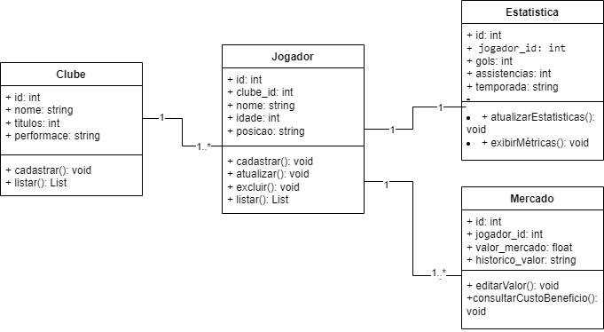

# Projeto Integrador - Software Funcional de Futebol

> Uma aplicação funcional em Python e SQLite estruturada para a centralização, gerenciamento e análise comparativa de dados de clubes, atletas e estatísticas de mercado.

---

## 📌 Sobre o Projeto

O **SoccerApp** foi desenvolvido para solucionar a fragmentação de informações no ecossistema do futebol, centralizando dados estruturados em um único lugar. O sistema atua cruzando o desempenho técnico dos atletas dentro de campo com a viabilidade e valorização financeira deles no mercado de transferências.

O projeto foi construído focando na eficiência técnica de banco de dados relacional, trazendo um **CRUD Completo** com regras rígidas de integridade referencial.

### Usuários-Alvo
* **Fãs de Futebol e Apostadores:** Monitoramento de estatísticas precisas e análise de tendências de desempenho.
* **Gestores de Ligas:** Comparação analítica de números para montagem e otimização de elencos.

---

## Tecnologias Utilizadas

* **Backend (Linguagem Core):** [Python](https://www.python.org/) – Motor principal do sistema, responsável pelas validações de dados, regras de negócio e controle de fluxo.
* **Interface Gráfica (Frontend Desktop):** [Tkinter](https://docs.python.org/3/library/tkinter.html) – Utilizado para a criação da interface visual em abas com o subsistema parametrizado `ttk`.
* **Banco de Dados:** [SQLite](https://www.sqlite.org/) – Solução relacional embutida (*serverless*), garantindo persistência segura e integridade de chaves estrangeiras.

---

## Modelagem de Dados & Arquitetura (DER)

A estrutura do banco de dados foi normalizada para garantir que o relacionamento entre as tabelas opere de forma limpa e sem redundâncias:

| Entidade Origem | Relacionamento | Entidade Destino | Regra de Negócio / Chave |
| :--- | :---: | :--- | :--- |
| **Clubes** | `1 ─── N` | **Jogadores** | Um clube possui vários jogadores; um jogador pertence a um único clube (`clube_id`). |
| **Jogadores** | `1 ─── 1` | **Estatísticas** | Cada jogador possui um único registro consolidado de métricas por temporada (`FOREIGN KEY UNIQUE`). |
| **Jogadores** | `1 ─── N` | **Mercado** | Monitoramento de flutuações e histórico de valor financeiro do atleta ao longo do tempo. |

---



---


---

## Funcionalidades do Sistema

O sistema opera de forma modular e integrada à interface, oferecendo as seguintes capacidades:

1. **Gestão de Perfis de Jogadores (CRUD Completo):** Cadastro, leitura, atualização e exclusão de atletas (Nome, Idade, Posição e estatísticas base).
2. **Catálogo de Clubes e Elencos (Relacionamento):** Vinculação direta de atletas a times específicos do banco de dados.
3. **Painel de Mercado e Valorização:** Módulo focado na edição e visualização do valor de mercado dos jogadores, permitindo análises de custo-benefício.

---

## 📁 Estrutura do Repositório

Abaixo está a organização estrutural exata do repositório:

```text
Projeto-Integrador-Software-Funcional-Futebol/
│
├── backend/                  # Toda a inteligência e lógica do sistema
│   ├── database.py           # Gerenciamento de conexão e inicialização do SQLite
│   └── crud.py               # Lógica de operações CRUD (Clubes, Jogadores, Estatísticas, Mercado)
│
├── frontend/                 # Camada visual do software
│   └── gui.py                # Construção da interface gráfica em Tkinter/TTK
│
├── futebol.db                # Arquivo do banco de dados local SQLite
├── main.py                   # Ponto de entrada (Inicialização do Sistema)
└── README.md                 # Documentação oficial


 ##   Como Executar o Aplicativo
Pré-requisitos
Python 3.x instalado em sua máquina.

Biblioteca Tkinter (geralmente já inclusa na instalação padrão do Python).

Passo a Passo
Clone o repositório para a sua máquina:

## Bash:
git clone https://github.com/Yuri-208/Projeto-Integrador-Software-Funcional-Futebol.git

## Bash:
cd Projeto-Integrador-Software-Funcional-Futebol

## Bash:
python main.py
